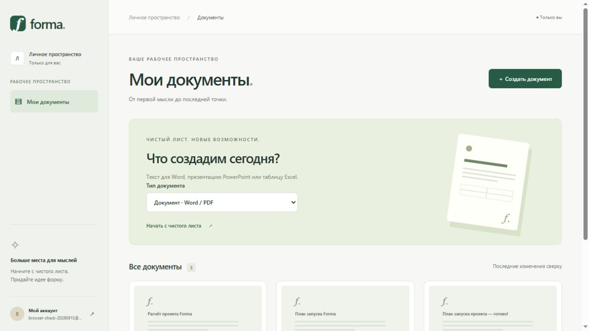

# Forma — документы в рабочем пространстве

Работающий сценарий: регистрация → выбор текстового документа, презентации или таблицы → ручное редактирование → PostgreSQL → повторное открытие → экспорт.

Приложение поддерживает AI-генерацию презентаций, текстовых документов и таблиц, ручное редактирование и экспорт Office. По умолчанию используется Gemini. Генерация новых изображений в бесплатном режиме отключена; работают загрузка своих картинок и поиск Public Domain / CC0 в Wikimedia Commons. OpenAI включается только явно и оплачивается отдельно. Конфигурация Vercel включена в репозиторий; публичная ссылка появится после проверки облачной базы.

## AI, редактирование и лимит

AI создаёт черновик: его можно просмотреть, применить к текущему документу и затем редактировать. В презентациях текст отображается по мере получения ответа; после применения доступны правки текста, смена оформления, перемещение/масштабирование картинки мышью и использование своей картинки как фона. На слайде одно изображение, включая фон. Подходящая картинка из Commons может найтись не для каждого слайда.

В Word/PDF доступны AI-текст, выбор Arial/Georgia/Verdana, размера, цвета, выравнивания и межстрочного интервала, добавление своих изображений. Картинки входят в DOCX и PDF; TXT/Markdown содержат их подписи. Excel получает редактируемые листы, числа и формулы от AI, которые затем проверяются общим контрактом и безопасным вычислителем.

Обычный пользователь может создать **8 документов за всё время** суммарно для всех типов. Копирование считается новым созданием; удаление не возвращает лимит. Редактирование, экспорт и повторная генерация внутри существующего документа не расходуют новые создания. Проверка и увеличение счётчика выполняются в транзакции PostgreSQL с блокировкой строки пользователя, включая конкурентные запросы.

Администратор не ограничен числом созданий. Роль не выдаётся автоматически по email регистрации. После проверки существующего аккаунта оператор запускает из `server`: `node scripts/set-admin.mjs owner@example.com`. Скрипт использует текущую `DATABASE_URL`; локальная роль не переносится автоматически в облачную базу. При миграции старой установки счётчик начинается с числа сохранившихся документов: ранее удалённые документы посчитать невозможно. Лимит относится к аккаунту, а не к личности — подтверждения email пока нет.

## Реализовано

Новые возможности: [AI-презентации, оформление, картинки и подключение API](docs/presentation-ai.md).

- Регистрация, вход, выход, восстановление сессии после перезагрузки.
- Пароли bcrypt, access JWT в памяти клиента, refresh token в HttpOnly cookie с ротацией и серверным отзывом.
- Личная библиотека с пагинацией, создание, открытие, переименование в редакторе, дублирование, удаление.
- Редактор заголовков, абзацев, списков, таблиц и разрывов страниц; добавление, удаление и перестановка блоков.
- Ручное сохранение и Ctrl+S, статусы сохранения, проверка revision и сохранение новых локальных правок во время запроса.
- Предпросмотр по общему контракту. Настоящий PDF с кириллицей, таблицами, переносами, повтором заголовков и нумерацией страниц.
- Предупреждение при уходе с несохранёнными изменениями; диалог поддерживает клавиатуру и удерживает фокус.
- Русский интерфейс и адаптивные экраны. Язык документа задаётся отдельно.
- Word: редактируемый DOCX, а также TXT и Markdown из текстовых блоков.
- PowerPoint: до 40 слайдов, титульный макет, содержимое, две колонки, текст, списки и таблицы; экспорт PPTX с нативными редактируемыми объектами.
- Excel: до 5 листов, 100 строк и 12 колонок на лист; текст, числа, даты, логические значения и формулы, ширина колонок, числовые форматы и жирный текст; экспорт XLSX с вычисленными результатами.

## Word, PowerPoint и Excel

В библиотеке выберите «Тип документа» и нажмите «Создать документ». В редакторе выбор формата экспорта зависит от вида содержимого:

| Вид | Форматы |
| --- | --- |
| Текст | PDF, DOCX, TXT, Markdown |
| Презентация | PPTX |
| Таблица | XLSX |

Все операции используют сохранённую revision и проверяют владельца. Нельзя изменить вид существующего документа. Исходные документы совместимы с расширенным контрактом. Для изображений требуется миграция `20260916000000_presentation_images`; примените `npm --prefix server run db:deploy`.

Формулы поддерживают арифметику `+ - * /`, скобки, ссылки на ячейки текущего листа, диапазоны и `SUM`, `AVERAGE`, `MIN`, `MAX`, `COUNT`. Например: `=A2*B2` и `=SUM(C2:C10)`. Имена функций английские, разделитель аргументов — запятая. Выберите тип ячейки «Формула» явно. Строка `=1+2` в текстовой ячейке сохраняется обычным текстом, без исполнения. Межлистовые ссылки, произвольные функции, внешние книги, макросы и импорт Office-файлов пока не поддерживаются. Удаление последней строки/колонки не сдвигает ссылки; выходящие за границы ссылки показывают ошибку. Расчёт имеет ограничение глубины и количества обращений. Экспорт с ошибкой формулы отклоняется.

У слайда до двух блоков (у титульного — один). Экспорт проверяет оценку вместимости: слишком длинную таблицу или текст нужно распределить на несколько слайдов. Предпросмотр отражает содержимое и макет, но не гарантирует пиксельное совпадение с PowerPoint. Слишком высокая строка Excel требует расширить колонки или разделить текст. PDF презентаций и рабочих листов пока недоступен.

Генераторы: `docx` 9.5.1, `pptxgenjs` 4.0.1, `exceljs` 4.4.0. Файлы формируются в памяти; настольный Microsoft Office для работы сервера не нужен. Проверка внутренней структуры ZIP/XML выполняется через JSZip в тестах. Для Office используется Arial; окончательная вёрстка зависит от шрифтов у получателя.



На скриншоте — тестовый локальный аккаунт и документ, созданные при проверке, а не вымышленные данные клиента.

## Требования

Windows / PowerShell, Node 24.11+ в ветке 24, npm 11, PostgreSQL (проверено на 18.6). Node проверен на 24.20.0; версия записана в `.nvmrc`.

Сохранены каталоги `ai-create/client` и `server` и два npm lock-файла. React/Vite, React Router, Axios и Oxlint сохранены. Добавлены Zustand, Zod, Prisma 7.10.0, bcryptjs, jsonwebtoken, cookie-parser, express-rate-limit и Playwright. Шрифты Noto Sans поставляются через `@fontsource/noto-sans` и встраиваются в PDF.

Используется обычный CSS с переменными. Неиспользуемый Tailwind удалён. MongoDB-кода в исходной копии не было; mongoose удалён. Внешние MongoDB не менялись.

## Быстрый запуск на текущем компьютере

Для этого checkout уже созданы отдельный кластер в `.local/pg-foundation`, база `ai_documents_dev` на порту 55432 и игнорируемый `server/.env` со случайным секретом. Системная служба PostgreSQL на стандартном порту не менялась.

Из корня проекта:

```powershell
./scripts/local-db.ps1 -Action start
npm --prefix server run db:deploy
npm --prefix server run build
npm --prefix server start
```

В другом терминале:

```powershell
npm --prefix ai-create/client run dev
```

Откройте **http://localhost:5173** и зарегистрируйте свой аккаунт. Для cookie/CSRF используйте именно hostname, указанный в `CLIENT_ORIGIN`: `localhost` и `127.0.0.1` не взаимозаменяемы.

Для разработки сервера вместо build/start используйте `npm --prefix server run dev`. Клиент проксирует `/api` на `http://127.0.0.1:3001`, порт Vite фиксирован. Остановка выделенного кластера: `./scripts/local-db.ps1 -Action stop`. Скрипт не управляет системной службой и не удаляет данные.

## Установка на другом компьютере

```powershell
npm --prefix server ci
npm --prefix ai-create/client ci
npm --prefix server run db:generate
Push-Location server
npx playwright install chromium
Pop-Location
```

Создайте отдельную PostgreSQL-роль и базу разработки через pgAdmin. Скопируйте шаблон, не перезаписывая существующий `.env`:

```powershell
if (-not (Test-Path server/.env)) { Copy-Item server/.env.example server/.env }
```

Локально заполните `DATABASE_URL` и `JWT_SECRET`. Последний должен содержать не менее 48 случайных символов; например, создайте его локально через `node -e "console.log(require('node:crypto').randomBytes(48).toString('hex'))"`. Пароль в URL необходимо кодировать, если он содержит специальные символы. Секреты не публикуйте и не присылайте в чат.

```powershell
npm --prefix server run db:deploy
npm --prefix server run db:status
```

`local-db.ps1` предназначен для уже созданного проектного кластера текущего компьютера; новая установка может использовать обычную отдельную базу PostgreSQL.

## Переменные окружения

| Переменная | Назначение |
| --- | --- |
| `DATABASE_URL` | Обязательное подключение PostgreSQL |
| `JWT_SECRET` | Обязательный секрет подписи, не менее 48 символов |
| `NODE_ENV` | development/test/production; production включает Secure у cookie |
| `HOST` | По умолчанию 127.0.0.1 |
| `PORT` | По умолчанию 3001 |
| `CLIENT_ORIGIN` | По умолчанию http://localhost:5173, без завершающего слеша |
| `OPENAI_API_KEY` | Серверный ключ OpenAI API для генерации; необязателен для ручного редактора |
| `AI_PROVIDER` | gemini по умолчанию; openai только при явном выборе |
| `GEMINI_API_KEY` | Серверный ключ проекта Google AI Studio |
| `GEMINI_MODEL` | gemini-3.5-flash-lite по умолчанию; нужна доступная квота модели в проекте |
| `OPENAI_MODEL` | Модель структуры и текста; по умолчанию gpt-6-astra |
| `OPENAI_IMAGE_MODEL` | Модель изображений; по умолчанию gpt-image-2.5-sunburst |
| `TEST_DATABASE_URL` | Отдельная мигрированная БД для интеграционных тестов |
| `PDF_QA_PATH` | Необязательный путь, куда интеграционный тест сохранит PDF для визуальной проверки |

Сервер и Prisma CLI читают `server/.env`. Окружение процесса имеет приоритет. Неверные настройки останавливают запуск без вывода credentials.

## Архитектура

React → REST API → controller → service → repository → Prisma → PostgreSQL.

Frontend: `features/auth`, `features/documents`, `features/editor`, общие компоненты отдельно. Zustand хранит сессию пользователя и редактор; сам access token остаётся в памяти API-модуля.

Backend: `routes`, `controllers`, `services`, `repositories`, `middleware`, `generators`. `app.ts` создаёт Express-приложение; `index.ts` управляет запуском/завершением; `config.ts` проверяет окружение; `database.ts` создаёт Prisma client.

Общий контракт находится в `server/src/contracts/document.ts`; клиент подключает именно его через alias `@contracts`. Этот модуль не содержит серверного кода. Клиент, серверная валидация, preview и PDF используют одинаковые типы и Zod-схемы.

Текущий контракт: `schemaVersion: 1`, `kind: text | presentation | spreadsheet`, metadata и элементы со стабильными UUID. Назначение документа (`purpose`) отделено от вида и экспорта. Неизвестная версия, дубли ID, неправильная ширина таблицы и превышение лимитов отклоняются. Необязательные поля оформления сохраняют совместимость старых презентаций.

`Document.content` — текущий JSONB-снимок, `DocumentVersion` — история. Владелец и связи реляционные. Удаление пользователя каскадно удаляет документы, версии и сессии. Версии создаются при создании и каждом успешном ручном сохранении изменённого документа; нажатия клавиш записей БД не создают. Интерфейс истории появится на этапе 4.

Обновление выполняет атомарную проверку ожидаемой revision и увеличивает её в транзакции вместе со снимком версии. Конфликт возвращает 409; редактор сохраняет локальные правки. Экспорт читает сохранённый снимок запрошенной revision. При несохранённых правках UI сначала сохраняет их; новые изменения во время сохранения требуют повторного сохранения перед экспортом.

## Сессии и безопасность

Access JWT: HS256, issuer/audience проверяются, срок 10 минут. Refresh token: случайные 48 байт, хеш SHA-256 в БД, срок семьи 7 дней без бесконечного продления, ротация при refresh. Повторное использование старого токена отзывает всю семью. Logout отзывает refresh-семью и очищает cookie. Уже выданный access JWT остаётся действительным до истечения 10 минут: немедленного отзыва stateless access token здесь нет.

Cookie: HttpOnly, SameSite=Strict, путь `/api/v1/auth`, Secure в production. Для записывающих запросов требуются точный `Origin` и `X-Requested-With: AI-Documents`. CORS допускает один origin. Схема рассчитана на один origin приложения/API через прокси; cross-site размещение не настроено. Клиент объединяет параллельный refresh и сериализует ротацию между вкладками через Web Locks, где они доступны.

Ownership проверяется для чтения, изменения, удаления, копирования и экспорта. Чужой документ возвращает 404. Лимит auth — 60 запросов/15 минут на IP, документов — 300; ограничения пока в памяти одного процесса. JSON body — 256 KiB. UI выводит содержимое как текст, HTML для PDF экранируется, браузеру экспорта запрещены сетевые запросы.

Для таблиц текста максимум 6 колонок, 100 строк, 1200 символов в ячейке; документ — до 120 блоков и 100000 символов сериализованного содержимого. PDF обрабатывается по одному на процесс, при занятости возвращает 503; запуск Chromium ограничен 15 секундами, дальнейшее формирование — 25 секундами. Файл возвращается из памяти, временные пользовательские файлы не создаются.

## API

Все продуктовые маршруты имеют префикс `/api/v1`.

| Метод | Путь | Назначение |
| --- | --- | --- |
| POST | /auth/register, /auth/login | email/password → user + accessToken; cookie отдельно |
| POST | /auth/refresh, /auth/logout | Ротация / отзыв refresh-сессии |
| GET | /auth/me | Текущий пользователь по access JWT |
| GET / POST | /documents | Пагинированный список `?page=1` / создание |
| GET / PATCH / DELETE | /documents/:documentId | Чтение / сохранение с expectedRevision / удаление |
| POST | /documents/:documentId/duplicate | Копирование документа |
| POST | /documents/:documentId/exports | `{format:"docx", revision:2}` → файл; также pdf, pptx, xlsx, txt, markdown |

Health без префикса: `GET /health` проверяет процесс; `/health/ready` выполняет SELECT 1 и возвращает 503 при недоступности БД. Readiness не проверяет наличие всех миграций: для этого используйте `db:status`.

Ошибки: `{error:{code,message,fieldErrors?,requestId}}`. Статусы: 400 неверный JSON/ID, 401 сессия, 403 CSRF, 404 отсутствующий/чужой документ, 409 revision/email, 413 размер, 422 валидация/несовместимый формат/ошибка формулы/переполнение, 429 лимит, 503 БД/экспорт. Экспорт возвращает соответствующий MIME type, Content-Disposition и X-Document-Revision.

## Миграции и проверки

Новая миграция создаётся только на базе разработки:

```powershell
npm --prefix server run db:migrate -- --name describe_change
```

`migrate dev` требует shadow database/соответствующих прав. На развёртывании применяется `db:deploy`; API миграции автоматически не запускает. Не используйте reset для обычного исправления схемы.

```powershell
./scripts/check.ps1
```

Скрипт последовательно выполняет typecheck/lint/tests/build сервера, Prisma validate и typecheck/lint/build клиента, останавливаясь при ошибке. Интеграционные тесты запускаются отдельно после настройки `TEST_DATABASE_URL` на мигрированную тестовую базу:

```powershell
npm --prefix server run test:db
```

Тесты создают собственные записи и удаляют их после проверки. Без TEST_DATABASE_URL завершаются ошибкой. Production-базу не используйте.

## Реально проверено

15 сентября 2026: typecheck/lint/build обоих проектов, 8 unit/HTTP/contract-тестов и 2 интеграционных теста на PostgreSQL 18.6. Проверены auth, cookie/rotation/replay/logout, ownership пользователя A/B, JSONB, уникальность версий, каскадное удаление, конфликт revision, экспорт определённой сохранённой версии.

В браузере: регистрация → создание → ввод текста/таблицы → сохранение → перезагрузка → восстановленный документ → PDF в Downloads → предупреждение об уходе → сохранение и переход → logout/login. Проверены библиотека и редактор при ширине 390 px.

Тестовый PDF разобран pypdf и просмотрен после рендера: 10 страниц, кириллица, все 35 строк длинной таблицы, повтор заголовков, длинный абзац и явный разрыв страницы. Число страниц зависит от содержимого и layout; preview не обещает точную пагинацию.

## Ограничения и следующий этап

- AI реализован для презентаций, Word и Excel. Реальные запросы Gemini проверены с успешным экспортом DOCX/XLSX; ответы, отказы и ошибки также проверяются через подменённый транспорт. Автоматического перехода на платного провайдера нет.
- Autosave, undo/redo, UI истории версий, восстановление черновика после закрытия браузера — этап 4. При ручном закрытии с подтверждённой потерей несохранённые изменения теряются.
- PDF презентаций/таблиц потребует собственного layout. Импорт DOCX/PPTX/XLSX, диаграммы слайдов и расширенные функции Excel пока отсутствуют.
- Полная тёмная тема, шаблоны, настройки и CI — последующие этапы. Инструкции Vercel: [публикация](docs/deployment.md).
- Сессии пока не очищаются фоновым заданием после истечения срока; перед публичным запуском нужна retention-политика и проверка deployment-настроек.
- При отсутствии выбранного системного шрифта PDF использует встроенный Noto Sans. Шрифт DOCX зависит от установленных шрифтов у получателя.
- Ограничения запросов и одновременной AI/PDF-работы находятся в памяти одного процесса. Для нескольких экземпляров нужна общая инфраструктура; лимит документов уже атомарен в PostgreSQL.

Проверка обновления 22 сентября 2026: 30 модульных/контрактных/HTTP/экспортных тестов; отдельные интеграционные проверки включают конкурентный лимит, копирование, удаление и исключение администратора. Старые результаты ниже описывают дополнительные проверки Office.

Проверка Office 15 сентября 2026: 13 unit/HTTP/contract/export-тестов, включая пересчёт формул после изменения исходных чисел, текст со знаком `=`, даты, несколько листов, нативные таблицы/текст PPTX и DOCX. Интеграционные тесты расширены на все три вида: CRUD, копирование, ownership, revision и выгрузка. В браузере проверены создание, сохранение, повторное открытие презентации/таблицы, результат формулы и скачивание Office-файлов. PPTX отрисован и визуально просмотрен через отдельный рендерер. DOCX проверен по XML; визуальный рендер не выполнен, поскольку bundled LibreOffice отсутствует. XLSX дополнительно прочитан независимым openpyxl; его сторонний preview-рендерер имеет расхождения для дат и пустых строк. Открытие непосредственно в Microsoft Office не проверялось.

`npm audit` сообщает об уязвимостях зависимостей, в том числе транзитивных `image-size` у PptxGenJS и `uuid` у ExcelJS. В PptxGenJS передаётся только PNG, декодированный и заново созданный sharp; внешние URL и SVG не принимаются. Экспорт не использует UUID v3/v5/v6 этих библиотек. Это не заменяет обновление и отдельную проверку зависимостей перед публичным запуском; массовый `audit fix --force` не применялся.

Официальные источники для следующего этапа: [OpenAI Structured Outputs](https://developers.openai.com/api/docs/guides/structured-outputs), [GPT-6 Astra](https://developers.openai.com/api/docs/models/gpt-6-astra). Для PDF используется [Playwright page.pdf](https://playwright.dev/docs/api/class-page#page-pdf).
